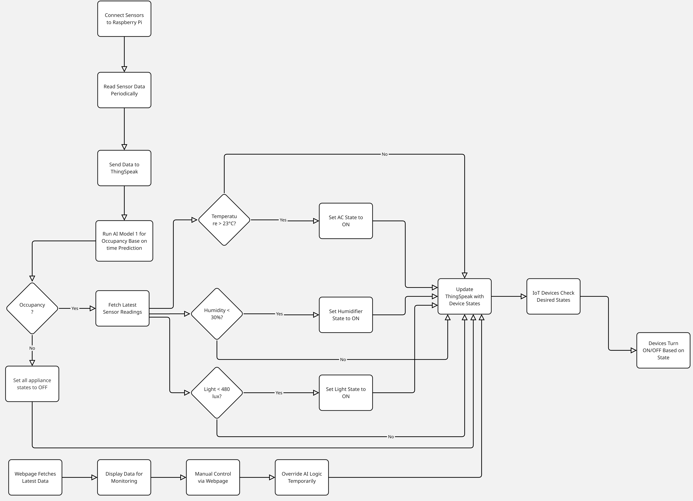

# AIOT_SmartHome



## Overview

This project implements an AI-driven smart home automation system. It utilizes Raspberry Pi devices for sensing environmental conditions and controlling appliances, ThingSpeak as the cloud platform for data aggregation and communication, and AI models for intelligent decision-making regarding occupancy and appliance states.

## Features

* **Sensor Data Acquisition:** Collects data for temperature, humidity, light levels, and occupancy using sensors connected to a Raspberry Pi.
* **Cloud Integration:** Sends sensor data to and receives commands from the ThingSpeak IoT platform.
* **AI-Powered Occupancy Prediction:** Employs a machine learning model to predict room occupancy based on time features (hour, day of week).
* **AI-Powered Appliance Control:** Uses a separate model to intelligently control appliances (Lights, AC, Humidity Machine) based on sensor readings and predicted occupancy.
* **Raspberry Pi Actuation:** Controls connected appliances using GPIO pins on a Raspberry Pi based on commands received from ThingSpeak.
* **Web Frontend:** Provides a simple web dashboard to monitor sensor data and manually control appliances.

## Architecture

1.  **Sensor Input:** A Raspberry Pi (`sensor_send_data.py`) reads data from connected sensors (DHT11, ADS1x15, etc.).
2.  **Data Upload:** The sensor data is sent to a specific ThingSpeak channel (ID: 2906053).
3.  **AI Controller:** The `smart_controller.py` script fetches the latest sensor data from ThingSpeak.
4.  **Prediction:**
    * It predicts occupancy using a time-based model (`occupancy_model/occupancy_predictor.h5`).
    * It predicts the optimal states for the Lights, AC, and Humidity Machine using the sensor data and predicted occupancy with its appliance control model (`model_output/appliance_control_model.h5`).
5.  **Command Output:** The predicted appliance states (ON/OFF commands) are sent back to specific fields in the ThingSpeak channel.
6.  **Appliance Actuation:** A second Raspberry Pi (`receive_data.py`) reads these command fields from ThingSpeak and toggles the corresponding GPIO pins to control the connected appliances.
7.  **Monitoring & Manual Control:** The `frontend2.html` page allows users to view sensor data (fetched from ThingSpeak) and manually override appliance states by sending commands to ThingSpeak.

## Components

* **`AI_model/`**: Contains the core logic and data for the AI components.
    * `smart_controller.py`: Main script for fetching data, running predictions, and sending commands.
    * `train_occupancy_predictor.py`: Script to train the occupancy prediction model.
    * `train_appliance_model.py`: Script to train the appliance control model.
    * `dataset.py` / `new_dataset.py`: Scripts for preprocessing and modifying training data.
    * `*.csv`: Datasets used for training (e.g., `Occupancy.csv`, `Occupancy_with_appliances.csv`, `Modified_Occupancy_with_appliances.csv`).
    * `occupancy_model/`: Contains the trained occupancy model (`occupancy_predictor.h5`), scaler (`scaler.joblib`), training history, and sample prediction data.
    * `model_output/`: Contains the trained appliance control model (`appliance_control_model.h5`), associated scaler (`appliance_scaler.joblib`), and training history.
    * `test_data.txt`: Sample data for testing scenarios.
    * `command.txt`: Example command to run the smart controller.
* **`Frontend/`**: Contains files for the web dashboard.
    * `frontend2.html`: The main HTML structure.
    * `index.css`: Stylesheet for the dashboard.
* **`RasberryPi/`**: Contains scripts intended to run on Raspberry Pi devices.
    * `sensor_send_data.py`: Reads sensor data and sends it to ThingSpeak.
    * `receive_data.py`: Reads commands from ThingSpeak and controls GPIO pins.
* **`test case/`**: Contains scripts for sending test data to ThingSpeak.

## Setup

1.  **Hardware:**
    * Two Raspberry Pi devices (recommended, one for sensors, one for actuators).
    * Sensors: DHT11 (Temperature/Humidity), Light Sensor (connected via ADS1x15), Occupancy Sensor.
    * Actuators: Relays connected to AC, Humidity Machine, Lights.
    * Optional: I2C LCD Display.
    * Appropriate wiring and power supplies.
2.  **Software:**
    * Install Python 3 on the Raspberry Pi(s) and the machine running the AI model.
    * Install required Python libraries:
        ```bash
        pip install requests RPi.GPIO Adafruit_DHT Adafruit_ADS1x15 RPLCD pandas numpy scikit-learn tensorflow joblib matplotlib seaborn
        ```
3.  **ThingSpeak:**
    * Create a ThingSpeak account and a new channel.
    * Configure the channel fields according to the mappings in `smart_controller.py` (Field 1: Occupancy, Field 3: AC_On, Field 4: Humidity_Machine_On, Field 5: Lights_On, Field 6: Temperature, Field 7: Humidity, Field 8: Light).
    * Note the Channel ID, Read API Key, and Write API Key.
4.  **Configuration:**
    * Update the `CHANNEL_ID`, `WRITE_API_KEY`, and `READ_API_KEY` variables in all relevant Python scripts (`smart_controller.py`, `sensor_send_data.py`, `receive_data.py`, and test scripts) with your ThingSpeak credentials.
    * Verify GPIO pin mappings in `sensor_send_data.py` and `receive_data.py` match your hardware setup.

## Usage

1.  **Sensor RPi:** Run `python sensor_send_data.py` on the Raspberry Pi connected to the sensors.
2.  **Actuator RPi:** Run `python receive_data.py` on the Raspberry Pi connected to the appliance relays.
3.  **AI Controller:** Run `python smart_controller.py --read-key YOUR_READ_KEY --write-key YOUR_WRITE_KEY --channel-id YOUR_CHANNEL_ID` (replace placeholders) on a machine with the necessary libraries and model files accessible[cite: 12, 16, 196, 1371, 2546]. This script can run continuously or simulate time ranges.
4.  **Frontend:** Host `frontend2.html` and `index.css` on a web server. Access the HTML page in a browser to monitor and control the system. Ensure the frontend JavaScript correctly points to your ThingSpeak channel and API keys if needed for manual control actions.

## Dependencies

* Python 3
* requests
* RPi.GPIO
* Adafruit_DHT
* Adafruit_ADS1x15
* RPLCD
* pandas
* numpy
* scikit-learn
* tensorflow
* joblib
* matplotlib
* seaborn
